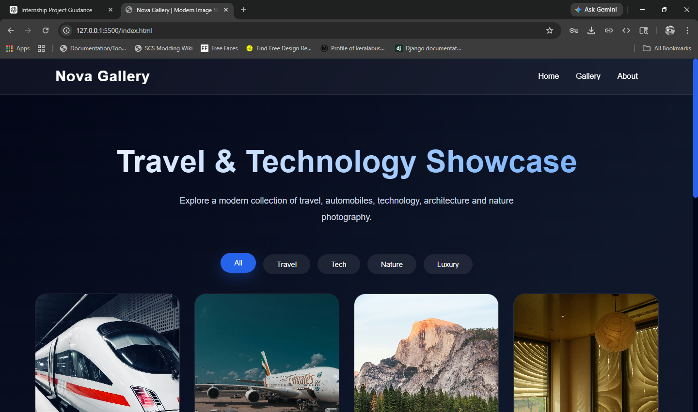
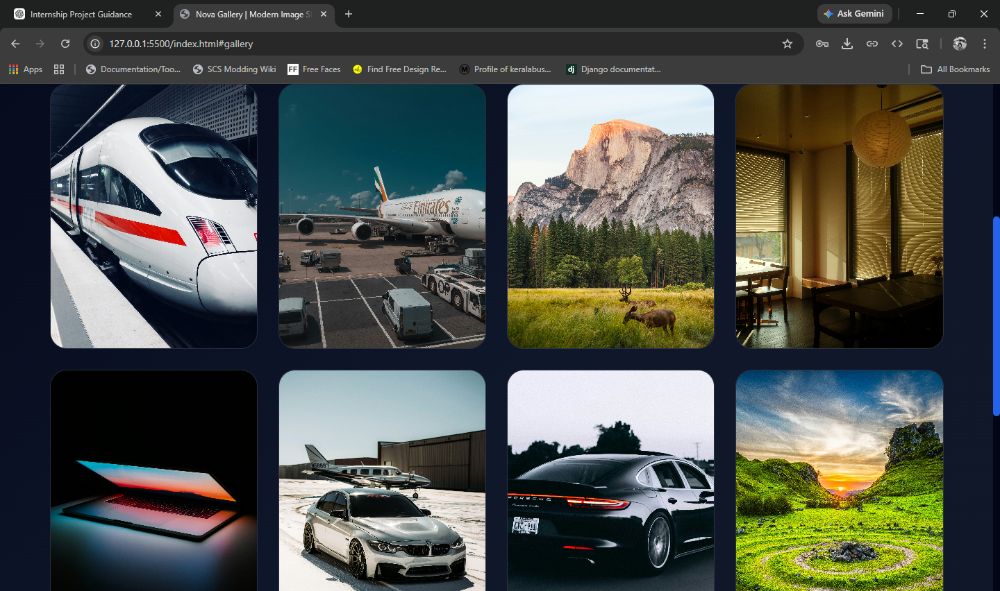
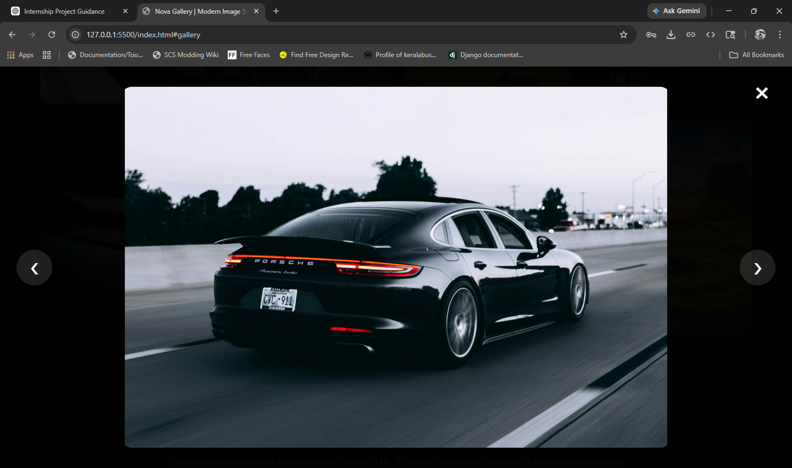
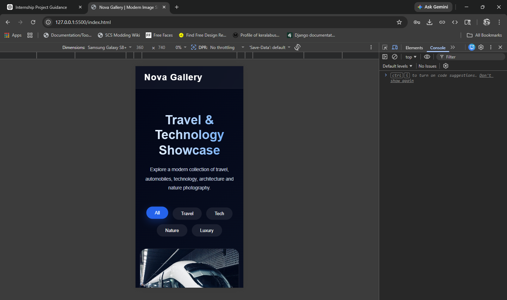
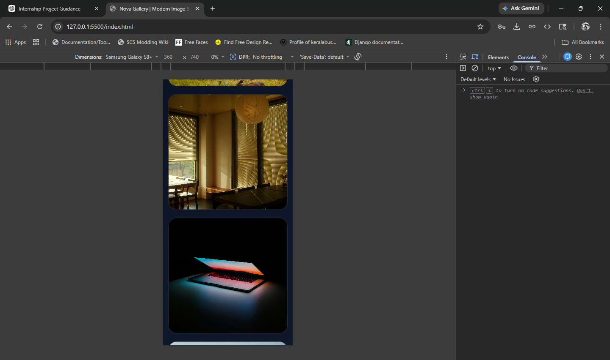
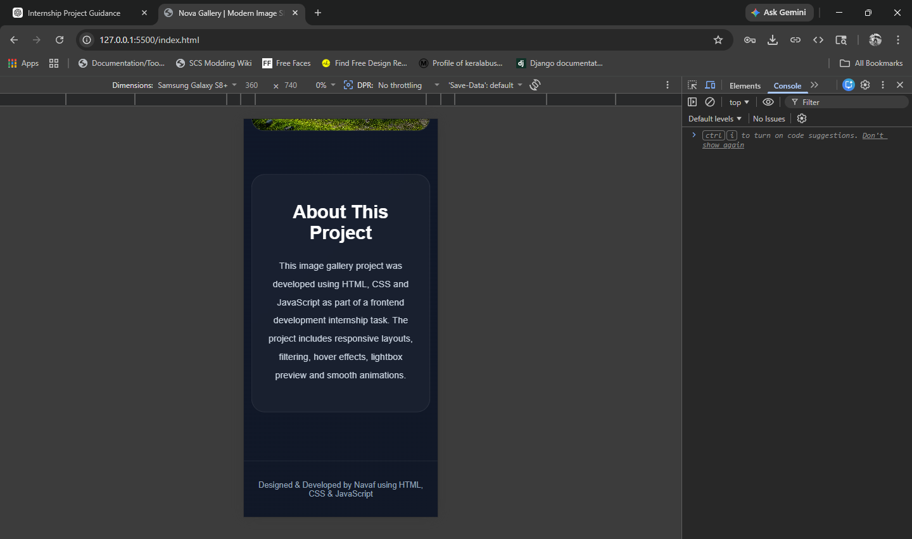

# Nova Gallery

A modern responsive image gallery built using HTML, CSS and JavaScript.

This project showcases responsive frontend design, interactive image previews, category filtering, smooth animations and lightbox functionality.

---

## Live Demo

```txt
https://navafv.github.io/CodeAlpha_ImageGallery/
```

---

## Features

- Responsive CSS Grid layout
- Interactive lightbox image preview
- Next & previous image navigation
- Category filtering system
- Keyboard navigation support
- Smooth scrolling
- Animated loading screen
- Hover animations & transitions
- Modern glassmorphism UI
- Mobile responsive design

---

## Technologies Used

- HTML5
- CSS3
- JavaScript (Vanilla JS)

---

## Folder Structure

```txt
CodeAlpha_ImageGallery/
│
├── index.html
├── style.css
├── script.js
├── README.md
│
└── images/
    ├── favicon.png
    ├── img1.jpg
    ├── img2.jpg
    ├── img3.jpg
    ├── img4.jpg
    ├── img5.jpg
    ├── img6.jpg
    ├── img7.jpg
    └── img8.jpg
```

---

## How To Run Locally

1. Download or clone the repository

```bash
git clone https://github.com/navafv/CodeAlpha_ImageGallery.git
```

2. Open the project folder in VS Code

3. Run using Live Server

---

## Screenshots








---

## Learning Outcomes

Through this project, I practiced:

- Responsive web design
- CSS Grid & Flexbox
- DOM manipulation
- JavaScript event handling
- UI animations
- Image filtering logic
- Lightbox implementation
- Accessibility improvements

---

## Internship Information

This project was developed as part of the CodeAlpha Frontend Development Internship Program.

---

## Author

### Navaf

Frontend Development Internship Project

---
